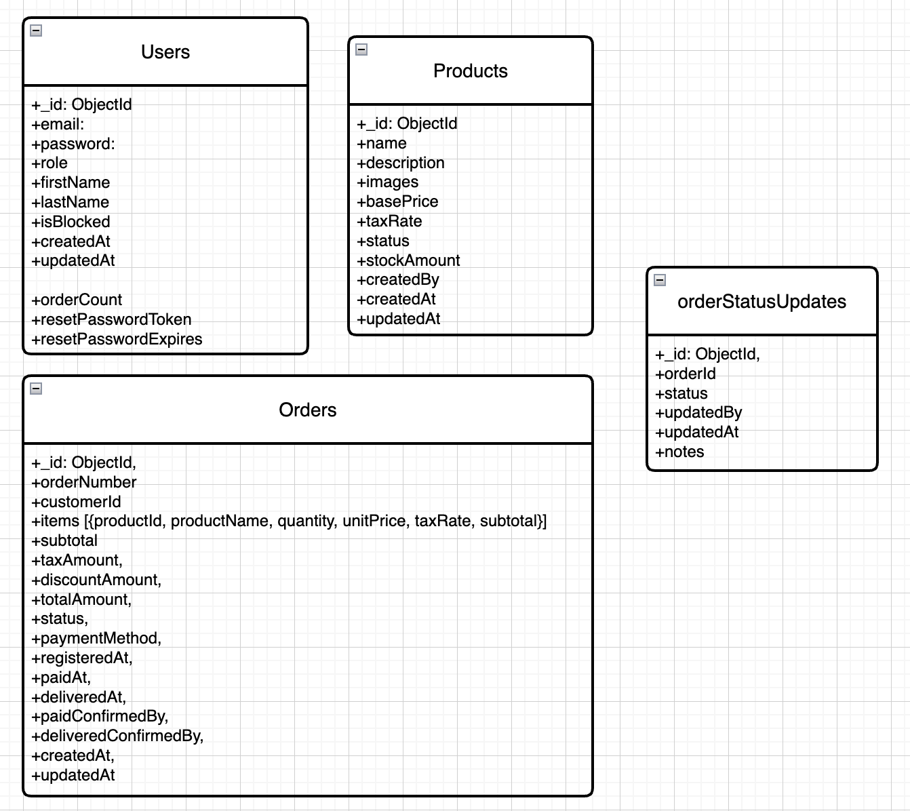

## Initial Mongo Schema

1. User Roles
- role: String (enum: ['admin', 'employee', 'customer'], required),
- orderCount: Number (default: 0), // For tracking every 3rd order discount

2. Product Management
- All fields required for now
- images as an array of multiple images for now
- createdBy to track which employee created it.

3. Order Management
- Items (Embedded) to avoid complex joins. 
- Snap Shot Approach, after placing order, until we cancel it, we cannot edit it.
- items [{productId, productName, quantity, unitPrice, taxRate, subtotal}]
- Will Later think of order edit/cancel part. 
- Because Looping to find Items and removing it could be expensive. (Not sure)
- discountAmount: Number (default: 0), // 10% discount for every 3rd order
- Status and Timestamp
- Employee Tracking for Audit

4.  Real-time Updates:
- Seprate one for order status history
- Web Socket Integration ???

### Idea
- Normalize when needed
- Denormalized for performance

